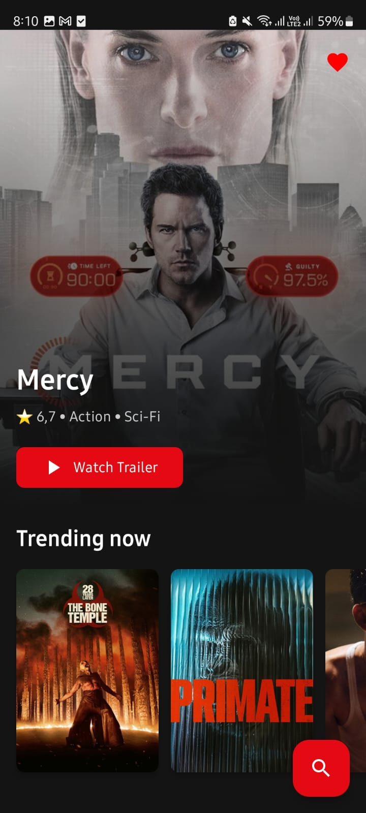
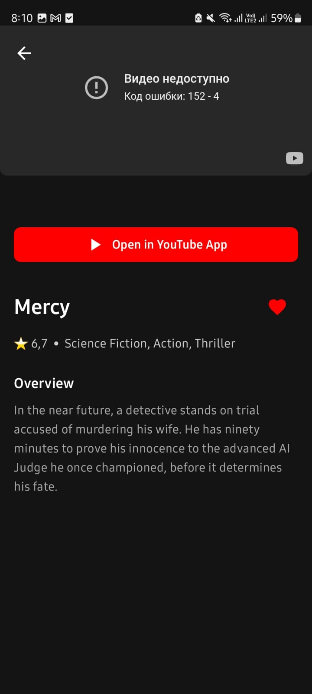
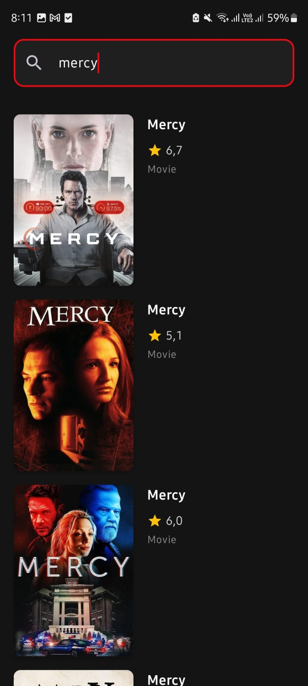
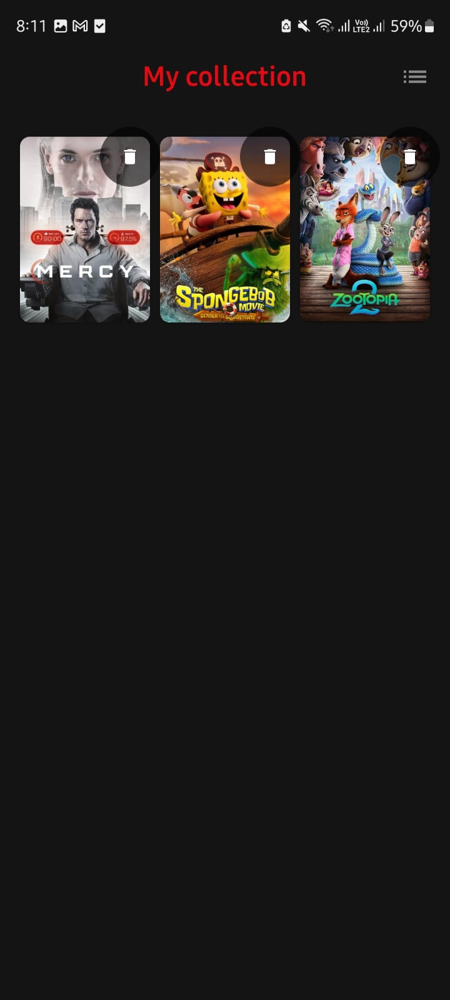

# 🎬 MovieHub

**MovieHub** is a high-performance Android application for movie enthusiasts, built with **Clean Architecture** and **Modern Android Development (MAD)** tools. It allows users to browse trending content, search for titles via the TMDB API, manage favorites with cloud synchronization, and authenticate using Firebase or Google Sign-In.

## 🚀 Key Features

* **TMDB Integration:** Real-time data fetching from the The Movie Database (TMDB) API including trending, popular, and detailed movie information.
* **Unified Search:** Powerful search functionality to explore a vast database of global cinema.
* **Dual-Layer Persistence:** * **Local:** Room Database for instant "Offline-first" access to favorite movies.
    * **Cloud:** Real-time synchronization of favorites with **Firebase Firestore**, ensuring data persists across devices.
* **Secure Authentication:** Integrated **Firebase Auth** with support for Email/Password and **Google One Tap Sign-In**.
* **Advanced UI:** * Smooth navigation with **Compose Navigation** and horizontal/vertical slide transitions.
    * Custom Shimmer effects for loading states.
    * Dynamic background and poster rendering using **Coil**.

## 🏗 Architecture Overview

The project is structured into three distinct layers to adhere to **Clean Architecture** principles:

1.  **Data Layer:** Implements Repositories, handling data logic between Retrofit (Remote) and Room (Local). Uses **Mappers** to convert DTOs and Entities into Domain Models.
2.  **Domain Layer:** Contains pure Kotlin Business Logic, including Repository interfaces and UseCases (Models).
3.  **Presentation Layer:** Built with **Jetpack Compose**. It utilizes **MVVM** and **StateFlow** to maintain a reactive and lifecycle-aware UI state.

## 🛠 Tech Stack

* **UI:** Jetpack Compose (Material 3).
* **Asynchronous:** Kotlin Coroutines & Flow (reactive data streams).
* **Dependency Injection:** Dagger Hilt.
* **Networking:** Retrofit 2 with Kotlinx Serialization.
* **Database:** Room (SQLite abstraction).
* **Backend:** Firebase Auth, Firestore.
* **Image Loading:** Coil.
* **Navigation:** Compose Navigation with custom animations.

## 📸 Screenshots

| Home & Trends | Movie Details | Search Interface | Favorites (Sync) |
|:---:|:---:|:---:|:---:|
|  |  |  |  |

## ⚠️ Known Limitations & Technical Notes

* **YouTube Player:** The application includes a YouTube player implementation using `android-youtube-player`. However, please note that **video playback is currently restricted** due to YouTube API's domain/package name validation policies. The UI components for the player are fully implemented and ready for production deployment upon API key authorization.
* **Sensitive Data:** All API keys (TMDB Access Tokens) and Google Service JSONs are managed via `BuildConfig` and excluded from the public repository for security.

## 🔐 Security & Setup

To run this project locally:

1.  **API Key:** Obtain an API Access Token from [TMDB](https://www.themoviedb.org/documentation/api) and add it to your `local.properties` as `TMDB_ACCESS_TOKEN`.
2.  **Firebase:** * Place your `google-services.json` in the `app/` folder.
    * Enable Email and Google Sign-in in your Firebase Console.
    * Add your `default_web_client_id` to your string resources.

## 👨‍💻 Author
**Ramiz Galiakberov**
* Android Developer
* Astana, Kazakhstan
